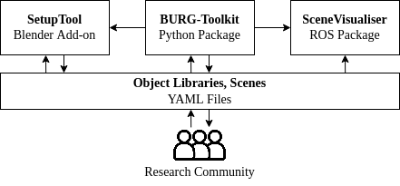
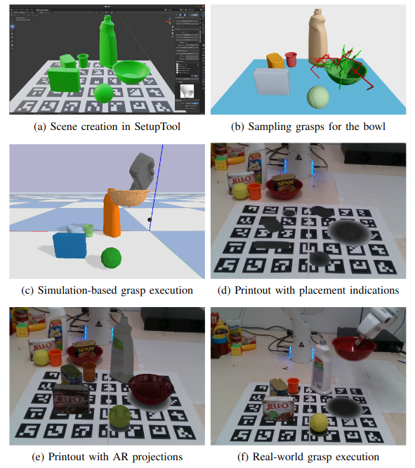

BURG-Toolkit: Reproducible Robot Grasping Experiments in Simulation and the Real World

Martin Rudorfer1, Markus Suchi2, Mohan Sridharan1, Markus Vincze2, Aleš Leonardis$^1$

1School of Computer Science, University of Birmingham, UK 
2Automation and Control Institue, TU Vienna, Austria

The BURG-Toolkit is a set of open-source tools for  **B**enchmarking and **U**nderstanding **R**obotic **G**rasping.
Our tools allow researchers to: 
1. create virtual scenes for generating training data and performing grasping in simulation, 
2. recreate the scene by arranging the corresponding objects accurately in the physical world for real robot experiments, supporting an analysis of the sim-to-real gap, and 
3. share the scenes with other researchers to foster comparability and reproducibility of experimental results.

## Quick Links

- [Presentation](https://www.youtube.com/watch?v=hsEkcbFItRQ&t=14201s) (YouTube) at the [ICRA 2022 Workshop on Releasing Robots into the Wild](https://www.dynsyslab.org/releasing-robots-into-the-wild-workshop/)
- [Paper](https://arxiv.org/abs/2205.14099) on arxiv
- Files required to reproduce the experiments in thr paper are available [here](/assets/experiment_files.zip) [zip, 49.9MB]
- Repositories:
    - [BURG-Toolkit](https://github.com/mrudorfer/burg-toolkit)
    - [SetupTool](https://github.com/markus-suchi/burg-setuptool)
    - [SceneVisualizer](https://github.com/mrudorfer/burg_scene_visualizer)

Feel free to get in touch if you have any comments or questions!

## Overview

The toolkit includes the following components:
- [BURG-Toolkit](#burg-toolkit), core Python package
- [SetupTool](#setuptool), Blender add-on for creating physically plausible scenes using 3D object models
- [SceneVisualizer](#scenevisualizer), ROS package for arranging real scenes with Augmented Reality

An exemplary workflow using the BURG-Toolkit:

(a-c) After creating the virtual scene using
the SetupTool, we can sample grasps and execute them in a physics-based
simulation; (d) From the SetupTool we can export a printout with an ArUco
marker board and the object height maps indicating the placements; (e) To
further facilitate the placement, our SceneVisualiser projects the objects into
the camera image for the user to make sure the real objects align visually;
and (f) Finally, the scene is set up for real robot experiments.

## BURG-Toolkit

At the core of the BURG-Toolkit is a Python package of the same name.
The [BURG-Toolkit](https://github.com/mrudorfer/burg-toolkit) serves as a backbone for the other components and offers the following features:
- core data structures for object types and instances, scenes, grippers, grasps and grasp sets
- antipodal grasp sampling
- physics simulation with pybullet
- depth/point cloud rendering with pybullet and/or pyrender
- metrics for evaluation of grasps and grasp sets
- visualization of scenes and grasps using open3d
- dataset creation
- printout generation
- generating stable poses of the objects used in virtual scene compositions
- collision and boundary checking of objects in virtual scenes

## SetupTool

The [SetupTool](https://github.com/markus-suchi/burg-setuptool) is a graphical front end of the BURG-Toolkit dedicated to virtual scene creation. It is implemented as a Blender add-on and handles the following tasks:
- creation of virtual scenes
- loading/saving virtual scenes
- visualization of collision and out of bound checks of individual objects
- saving of printout sheets of virtual scenes

Scenes can be created in various sizes, the templates automatically adjust.
If necessary, the templates can be split up for printing to the desired page size.

## SceneVisualizer

The [SceneVisualizer](https://github.com/mrudorfer/burg_scene_visualizer) is a ROS package for arranging the objects for real-world experiments.
It uses Augmented Reality to project the objects into the real scene.

## Acknowledgments

This work was conducted within the [BURG research project](https://burg.acin.tuwien.ac.at/) which is supported by CHIST-ERA under EPSRC grant no. EP/S032487/1 and FWF grant no. I3967-N30.